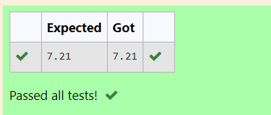

# DISTANCE-BETWEEN-TWO-POINTS

## AIM:
To write a python program to find the distance two 2 points
## ALGORITHM:
### Step 1:
import the math library to solve using distance formula

### Step 2:
enter the given matrices

### Step 3:
 Substitute the values in the distance formula formula
### Step 4:
Print the output with two values after decimal
### PROGRAM:
  ```
#Program to find the distance between two points.
#Developed by: H.Berjin Shabeck
#RegisterNumber:22007550
import math
a=[10,6]
b=[4,2]
dist=math.sqrt (((b[0]-a[0])**2)+((b[1]-a[1])**2))
print("{:.2f}".format(dist))
```
### OUTPUT:


### RESULT:
Thus the distance between two points is executed successfully